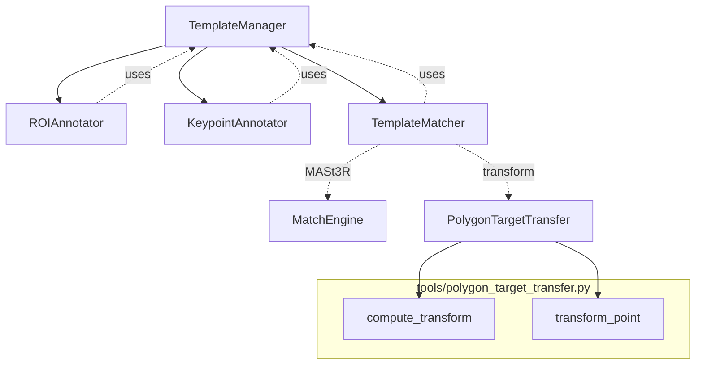
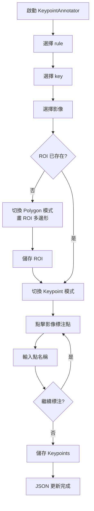
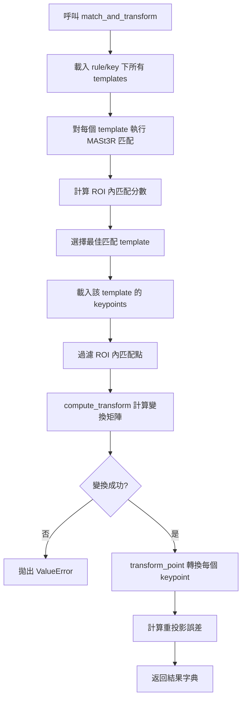

# Template 標注與管理系統設計

## 系統概覽

本系統為兩層結構的 Template 標注與管理系統，專為影像模板標注與匹配設計。資料夾結構如下：

```
templates/
├── a_lab/              ← rule name (第一層)
│   ├── dog/            ← key name (第二層)
│   │   ├── front.jpg
│   │   ├── front_roi.json
│   │   ├── side.jpg
│   │   └── side_roi.json
│   └── cat/
│       └── ...
├── b_lab/              ← 另一個 rule
│   └── ...
```

### 功能模組
1. **標注工具 (GUI)**：選擇 rule → key → 影像 → 標記多邊形 → 儲存 `*_roi.json`。
2. **匹配功能**：指定 rule + key → 載入該 key 下所有 template → 逐一匹配（使用 MASt3R 特徵匹配，參考現有 [ARCHITECTURE.md](docs/ARCHITECTURE.md)）。

系統強調擴展性（模組化類別設計）與維護性（標準 JSON Schema、清晰介面）。

## 1. JSON Schema (ROI JSON 結構)

`*_roi.json` 檔案定義如下，使用 JSON Schema 確保資料一致性：

```json
{
  "$schema": "http://json-schema.org/draft-07/schema#",
  "type": "object",
  "properties": {
    "version": {
      "type": "string",
      "description": "Schema 版本",
      "default": "1.0"
    },
    "image_metadata": {
      "type": "object",
      "properties": {
        "width": { "type": "integer" },
        "height": { "type": "integer" },
        "filename": { "type": "string" }
      },
      "required": ["width", "height", "filename"]
    },
    "polygons": {
      "type": "array",
      "items": {
        "type": "object",
        "properties": {
          "label": {
            "type": "string",
            "description": "多邊形標籤 (e.g., 'target')"
          },
          "points": {
            "type": "array",
            "description": "順時針/逆時針閉合多邊形頂點 [[x1,y1], [x2,y2], ...]",
            "items": {
              "type": "array",
              "items": { "type": "number" },
              "minItems": 2,
              "maxItems": 2
            },
            "minItems": 3
          },
          "metadata": {
            "type": "object",
            "description": "額外中繼資料 (e.g., timestamp, user_id)",
            "additionalProperties": true
          }
        },
        "required": ["label", "points"]
      }
    }
  },
  "required": ["image_metadata", "polygons"]
}
```

範例 `front_roi.json`：
```json
{
  "version": "1.0",
  "image_metadata": {
    "width": 1920,
    "height": 1080,
    "filename": "front.jpg"
  },
  "polygons": [
    {
      "label": "target",
      "points": [[100, 100], [200, 100], [200, 200], [100, 200]],
      "metadata": { "annotated_by": "user1", "timestamp": "2024-01-01T00:00:00Z" }
    }
  ]
}
```

## 2. 主要類別設計

### 類別關係圖
```mermaid
graph TD
    TM[TemplateManager] --> RA[ROIAnnotator]
    TM --> TMatch[TemplateMatcher]
    RA -.->|uses| TM
    TMatch -.->|uses| TM
    TMatch -.->|MASt3R| MatchEngine[MatchEngine<br/>(外部匹配引擎)]
```

### 類別定義 (Python Pseudo-code)

```python
from dataclasses import dataclass
from typing import List, Dict, Any
from pathlib import Path

@dataclass
class Template:
    img_path: Path
    roi_path: Path
    roi_data: Dict[str, Any]  # 載入後的 JSON

class TemplateManager:
    """管理 templates 資料夾結構"""
    def __init__(self, root_dir: Path = Path('templates')):
        self.root = root_dir
    
    def list_rules(self) -> List[str]:
        """列出所有 rule names"""
        return [d.name for d in self.root.iterdir() if d.is_dir()]
    
    def list_keys(self, rule: str) -> List[str]:
        """列出指定 rule 下的 key names"""
        rule_dir = self.root / rule
        return [d.name for d in rule_dir.iterdir() if d.is_dir()]
    
    def get_templates(self, rule: str, key: str) -> List[Template]:
        """載入指定 key 下所有 templates (jpg + roi.json)"""
        key_dir = self.root / rule / key
        templates = []
        for img_path in key_dir.glob('*.jpg'):
            roi_path = img_path.with_suffix('.json')
            if roi_path.exists():
                with open(roi_path) as f:
                    roi_data = json.load(f)
                templates.append(Template(img_path, roi_path, roi_data))
        return templates

class ROIAnnotator:
    """GUI 標注工具"""
    def __init__(self, manager: TemplateManager):
        self.manager = manager  # 依賴注入
    
    def annotate(self, rule: str, key: str, img_name: str) -> Path:
        """開啟 GUI 標注，儲存 roi.json"""
        # GUI 邏輯: 使用 tkinter/matplotlib 繪圖、多邊形繪製
        # ...
        roi_path = (self.manager.root / rule / key / f'{img_name}_roi.json')
        # 儲存 roi_data 到 roi_path
        return roi_path

class TemplateMatcher:
    """模板匹配器"""
    def __init__(self, manager: TemplateManager, match_engine=None):
        self.manager = manager
        self.match_engine = match_engine or MASt3RMatchEngine()  # 可替換
    
    def match(self, rule: str, key: str, target_img_path: Path) -> List[Dict[str, Any]]:
        """對所有 templates 執行匹配，返回結果列表"""
        templates = self.manager.get_templates(rule, key)
        results = []
        for template in templates:
            matches = self.match_engine.get_matches(template.img_path, target_img_path)
            filtered_matches = self._filter_in_polygon(matches, template.roi_data['polygons'])
            transform = self._compute_transform(filtered_matches)  # RANSAC
            score = self._compute_score(transform)
            results.append({
                'template': template.img_path.name,
                'score': score,
                'transform': transform,
                'inliers': len(filtered_matches)
            })
        return sorted(results, key=lambda x: x['score'], reverse=True)
    
    def _filter_in_polygon(self, matches, polygons): ...
    def _compute_transform(self, matches): ...  # RANSAC
    def _compute_score(self, transform): ...  # inlier ratio 等
```

**介面設計**：
- `TemplateManager` 提供資料存取抽象層，支持動態新增 rule/key。
- `ROIAnnotator` 與 `TemplateMatcher` 依賴 `TemplateManager`，易於測試/替換。
- `TemplateMatcher` 的 `match_engine` 可擴展（e.g., MASt3R, SIFT）。

## 3. 匹配流程

### 詳細步驟
1. 指定 `rule` + `key` + `target_img`。
2. `TemplateManager.get_templates()` 載入所有 templates。
3. 對每個 template：
   4. MASt3R 特徵匹配 → 匹配點。
   5. 過濾多邊形內匹配點。
   6. RANSAC 計算變換矩陣（partial/affine/homography）。
   7. 計算匹配分數（inlier 比例、殘差）。
4. 聚合結果，按分數排序。

### 流程圖 (Mermaid)
```mermaid
graph TD
    A[輸入: rule, key, target_img] --> B[TemplateManager.get_templates(rule, key)]
    B --> C{有 templates?}
    C -->|否| Z[返回空結果]
    C -->|是| D[foreach template]
    D --> E[MASt3R: get_matches(template.jpg, target_img)]
    E --> F[filter_matches_in_polygon(matches, roi.polygons)]
    F --> G[RANSAC: compute_transform(filtered_matches)]
    G --> H[compute_score(transform)]
    H --> I[收集結果]
    I --> J[排序 by score 降序]
    J --> K[輸出: List[MatchResult]]
```

此設計確保模組化、易擴展（新增 matcher、GUI 框架），並與現有 MASt3R 整合。

---

## 4. 自定義標注點轉換設計

### 4.1 功能概述

此功能允許用戶在 template 影像上標注**多個自定義命名點**（keypoints），並在匹配時自動將這些點座標轉換到目標影像上。

**核心能力：**
- 在 template ROI 內標注任意數量的命名點
- 匹配時使用 MASt3R 特徵匹配計算變換矩陣
- 批量轉換所有 keypoints 到 target 影像座標系

**複用現有模組：**
- [`compute_transform()`](tools/polygon_target_transfer.py:344) - 計算變換矩陣（partial/affine/homography/fundamental）
- [`transform_point()`](tools/polygon_target_transfer.py:428) - 轉換單點座標
- [`filter_matches_in_polygon()`](tools/polygon_target_transfer.py:202) - 過濾 ROI 內匹配點

### 4.2 JSON Schema 擴展

#### 4.2.1 Schema v1.1 定義

```json
{
  "$schema": "http://json-schema.org/draft-07/schema#",
  "type": "object",
  "properties": {
    "version": {
      "type": "string",
      "description": "Schema 版本",
      "default": "1.1"
    },
    "image_metadata": {
      "type": "object",
      "properties": {
        "width": { "type": "integer" },
        "height": { "type": "integer" },
        "filename": { "type": "string" }
      },
      "required": ["width", "height", "filename"]
    },
    "polygons": {
      "type": "array",
      "description": "ROI 多邊形陣列",
      "items": {
        "type": "object",
        "properties": {
          "label": { "type": "string" },
          "points": {
            "type": "array",
            "items": {
              "type": "array",
              "items": { "type": "number" },
              "minItems": 2,
              "maxItems": 2
            },
            "minItems": 3
          },
          "metadata": { "type": "object" }
        },
        "required": ["label", "points"]
      }
    },
    "keypoints": {
      "type": "object",
      "description": "自定義命名標注點 - key 為名稱, value 為 [x, y] 座標",
      "additionalProperties": {
        "type": "array",
        "items": { "type": "number" },
        "minItems": 2,
        "maxItems": 2
      }
    }
  },
  "required": ["image_metadata", "polygons"]
}
```

#### 4.2.2 範例檔案

```json
{
  "version": "1.1",
  "image_metadata": {
    "width": 1280,
    "height": 720,
    "filename": "front.jpg"
  },
  "polygons": [
    {
      "label": "target",
      "points": [[120, 116], [89, 486], [662, 483], [646, 123], [120, 116]],
      "metadata": { "annotated_by": "user" }
    }
  ],
  "keypoints": {
    "center": [391.0, 300.0],
    "top_left_corner": [120.0, 116.0],
    "bottom_right_corner": [662.0, 483.0],
    "color_patch_1": [150.0, 180.0],
    "color_patch_24": [600.0, 440.0]
  }
}
```

### 4.3 類別 API 設計擴展

#### 4.3.1 類別關係圖



#### 4.3.2 TemplateManager 擴展

```python
class TemplateManager:
    # ... 現有方法 ...
    
    def get_keypoints(self, rule: str, key: str, image_name: str) -> Dict[str, Tuple[float, float]]:
        """
        讀取指定影像的標注點
        
        Args:
            rule: 規則名稱
            key: 鍵名稱
            image_name: 影像檔名 (不含路徑, e.g., 'front.jpg')
            
        Returns:
            dict: {keypoint_name: (x, y), ...}
            若無 keypoints 或檔案不存在，返回空 dict
        """
        roi_path = self.root / rule / key / f"{Path(image_name).stem}_roi.json"
        if not roi_path.exists():
            return {}
        with open(roi_path, 'r') as f:
            data = json.load(f)
        kp = data.get('keypoints', {})
        return {name: tuple(coords) for name, coords in kp.items()}
    
    def set_keypoints(self, rule: str, key: str, image_name: str,
                      keypoints: Dict[str, Tuple[float, float]]) -> bool:
        """
        儲存/更新標注點 (會保留現有 polygons)
        
        Args:
            keypoints: {keypoint_name: (x, y), ...}
            
        Returns:
            bool: 成功返回 True
        """
        roi_path = self.root / rule / key / f"{Path(image_name).stem}_roi.json"
        if roi_path.exists():
            with open(roi_path, 'r') as f:
                data = json.load(f)
        else:
            # 需要先標注 polygon ROI
            raise FileNotFoundError(f"ROI file not found: {roi_path}")
        
        data['version'] = '1.1'
        data['keypoints'] = {name: list(coords) for name, coords in keypoints.items()}
        
        with open(roi_path, 'w') as f:
            json.dump(data, f, indent=2)
        return True
```

#### 4.3.3 ROIAnnotator 擴展 (KeypointAnnotator)

```python
class KeypointAnnotator:
    """標注點 GUI 工具 - 擴展 ROIAnnotator"""
    
    def __init__(self, manager: TemplateManager):
        self.manager = manager
        self.keypoints: Dict[str, Tuple[float, float]] = {}
        self.mode: str = 'polygon'  # 'polygon' | 'keypoint'
    
    def set_mode(self, mode: str):
        """切換標注模式: 'polygon' 或 'keypoint'"""
        self.mode = mode
        self._update_ui_for_mode()
    
    def on_click(self, event):
        """點擊事件處理"""
        x, y = self._canvas_to_image_coords(event.x, event.y)
        
        if self.mode == 'polygon':
            self._add_polygon_point(x, y)
        elif self.mode == 'keypoint':
            self._prompt_keypoint_name(x, y)
    
    def _prompt_keypoint_name(self, x: float, y: float):
        """彈出對話框要求輸入標注點名稱"""
        name = simpledialog.askstring("標注點名稱", "請輸入標注點名稱:")
        if name:
            self.keypoints[name] = (x, y)
            self._draw_keypoint(name, x, y)
    
    def _draw_keypoint(self, name: str, x: float, y: float):
        """在 canvas 上繪製標注點"""
        cx, cy = self._image_to_canvas_coords(x, y)
        self.canvas.create_oval(cx-6, cy-6, cx+6, cy+6,
                                fill='blue', outline='white', width=2, tags='keypoint')
        self.canvas.create_text(cx+10, cy, text=name, anchor='w',
                                fill='blue', font=('Arial', 10), tags='keypoint')
    
    def save_keypoints(self):
        """儲存標注點到 ROI JSON"""
        if not self.keypoints:
            messagebox.showwarning("警告", "尚未標注任何點")
            return
        
        self.manager.set_keypoints(
            self.current_rule,
            self.current_key,
            self.current_image,
            self.keypoints
        )
        messagebox.showinfo("成功", f"已儲存 {len(self.keypoints)} 個標注點")
    
    def load_existing_keypoints(self):
        """載入已存在的標注點"""
        self.keypoints = self.manager.get_keypoints(
            self.current_rule,
            self.current_key,
            self.current_image
        )
        for name, (x, y) in self.keypoints.items():
            self._draw_keypoint(name, x, y)
```

#### 4.3.4 TemplateMatcher 擴展

```python
class TemplateMatcher:
    # ... 現有方法 ...
    
    def match_and_transform(
        self,
        rule: str,
        key: str,
        target_image_path: Path,
        transform_method: str = 'homography',
        ransac_thresh: float = 5.0
    ) -> Dict[str, Any]:
        """
        匹配最佳 template 並轉換所有 keypoints
        
        Args:
            rule: 規則名稱
            key: 鍵名稱
            target_image_path: 目標影像路徑
            transform_method: 變換方法 'partial'|'affine'|'homography'|'fundamental'
            ransac_thresh: RANSAC 閾值 (像素)
            
        Returns:
            dict: {
                'best_template': str,         # 最佳匹配的 template 檔名
                'match_score': float,         # 匹配分數 (0~1)
                'transform_matrix': np.ndarray, # 變換矩陣
                'transformed_keypoints': {    # 轉換後的 keypoints
                    'name1': (x', y'),
                    'name2': (x', y'),
                    ...
                },
                'reprojection_error': (mean, std),  # 重投影誤差
                'num_inliers': int,           # inlier 數量
                'inlier_ratio': float         # inlier 比例
            }
            
        Raises:
            ValueError: 若沒有足夠匹配點或 keypoints
        """
        from tools import compute_transform, transform_point, compute_reprojection_error
        
        # Step 1: 執行基礎匹配找最佳 template
        match_result = self.match(rule, key, target_image_path)
        if match_result['best'] is None:
            raise ValueError("No template matched")
        
        best_template_name = match_result['best']['template']
        templates = self.manager.load_templates(rule, key)
        best_template = next(t for t in templates if t.img_path.name == best_template_name)
        
        # Step 2: 取得 keypoints
        keypoints = self.manager.get_keypoints(rule, key, best_template_name)
        if not keypoints:
            raise ValueError(f"No keypoints defined for {best_template_name}")
        
        # Step 3: 取得匹配點
        matches = self._get_matches(best_template.img_path, target_image_path)
        
        # Step 4: 過濾 ROI 內匹配點
        polygon = best_template.roi_data['polygons'][0]['points']
        filtered_im0, filtered_im1 = filter_matches_in_polygon(
            matches[:, :2], matches[:, 2:4], polygon
        )
        
        # Step 5: 計算變換矩陣
        M, inliers, info = compute_transform(
            filtered_im0, filtered_im1,
            method=transform_method,
            ransac_thresh=ransac_thresh
        )
        
        if M is None:
            raise ValueError("Failed to compute transform")
        
        # Step 6: 轉換所有 keypoints
        transformed_kps = {}
        for name, (x, y) in keypoints.items():
            result = transform_point(M, (x, y), method=transform_method)
            if isinstance(result, tuple):
                transformed_kps[name] = result
            elif isinstance(result, dict) and 'epiline' in result:
                transformed_kps[name] = result  # fundamental 返回 epiline
        
        # Step 7: 計算重投影誤差
        inlier_mask = inliers.ravel().astype(bool) if inliers is not None else np.ones(len(filtered_im0), dtype=bool)
        reproj_mean, reproj_std = compute_reprojection_error(
            M, filtered_im0[inlier_mask], filtered_im1[inlier_mask], method=transform_method
        )
        
        num_inliers = int(np.sum(inliers)) if inliers is not None else len(filtered_im0)
        
        return {
            'best_template': best_template_name,
            'match_score': match_result['best']['score'],
            'transform_matrix': M,
            'transformed_keypoints': transformed_kps,
            'reprojection_error': (reproj_mean, reproj_std),
            'num_inliers': num_inliers,
            'inlier_ratio': num_inliers / len(filtered_im0) if len(filtered_im0) > 0 else 0.0,
            'transform_info': info
        }
    
    def transform_keypoints(
        self,
        template_path: Path,
        target_path: Path,
        keypoints: Dict[str, Tuple[float, float]],
        polygon: List[List[float]],
        transform_method: str = 'homography'
    ) -> Dict[str, Tuple[float, float]]:
        """
        低階 API: 直接批量轉換 keypoints
        
        Args:
            template_path: template 影像路徑
            target_path: target 影像路徑
            keypoints: 要轉換的 keypoints {name: (x, y)}
            polygon: ROI 多邊形頂點
            transform_method: 變換方法
            
        Returns:
            dict: 轉換後的 keypoints {name: (x', y')}
        """
        from tools import compute_transform, transform_point, filter_matches_in_polygon
        
        # 獲取匹配點
        matches = self._get_matches(template_path, target_path)
        
        # 過濾 ROI 內匹配點
        filtered_im0, filtered_im1 = filter_matches_in_polygon(
            matches[:, :2], matches[:, 2:4], polygon
        )
        
        # 計算變換
        M, _, _ = compute_transform(filtered_im0, filtered_im1, method=transform_method)
        
        # 批量轉換
        return {
            name: transform_point(M, pt, method=transform_method)
            for name, pt in keypoints.items()
            if not isinstance(transform_point(M, pt, method=transform_method), dict)
        }
```

### 4.4 工作流程

#### 4.4.1 標注階段流程



#### 4.4.2 匹配轉換階段流程



### 4.5 使用範例

```python
from template_system import TemplateManager, TemplateMatcher
from pathlib import Path

# 初始化
manager = TemplateManager(root_dir=Path('templates'))
matcher = TemplateMatcher(manager, device='mps')

# 執行匹配與轉換
result = matcher.match_and_transform(
    rule='a_lab',
    key='colorchecker',
    target_image_path=Path('live_frame.jpg'),
    transform_method='homography'
)

# 使用結果
print(f"最佳匹配 template: {result['best_template']}")
print(f"匹配分數: {result['match_score']:.3f}")
print(f"變換方法: {result['transform_info']['description']}")
print(f"Inliers: {result['num_inliers']} ({result['inlier_ratio']*100:.1f}%)")
print(f"重投影誤差: {result['reprojection_error'][0]:.2f} ± {result['reprojection_error'][1]:.2f} px")

print("\n轉換後的標注點:")
for name, coords in result['transformed_keypoints'].items():
    print(f"  {name}: ({coords[0]:.1f}, {coords[1]:.1f})")

# 輸出範例:
# 最佳匹配 template: front.jpg
# 匹配分數: 0.324
# 變換方法: Perspective Transform (for planar objects)
# Inliers: 156 (78.0%)
# 重投影誤差: 2.31 ± 1.45 px
#
# 轉換後的標注點:
#   center: (412.3, 287.6)
#   top_left_corner: (134.2, 98.1)
#   bottom_right_corner: (689.4, 471.2)
#   color_patch_1: (162.8, 165.3)
#   color_patch_24: (621.7, 428.9)
```

### 4.6 實作優先級建議

| 優先級 | 項目 | 說明 |
|--------|------|------|
| P0 | JSON Schema v1.1 | 向後相容，新增 keypoints 欄位 |
| P0 | `TemplateManager.get_keypoints()` | 讀取標注點 |
| P0 | `TemplateMatcher.match_and_transform()` | 核心匹配+轉換功能 |
| P1 | `TemplateManager.set_keypoints()` | 程式化設定標注點 |
| P1 | KeypointAnnotator GUI | 視覺化標注工具 |
| P2 | `TemplateMatcher.transform_keypoints()` | 低階批量轉換 API |

### 4.7 相容性考量

1. **JSON 向後相容**：
   - `keypoints` 為 optional 欄位
   - 舊版 v1.0 不含 keypoints 的 JSON 仍可正常載入
   - 讀取時若無 keypoints 返回空 dict

2. **API 向後相容**：
   - 現有 [`TemplateMatcher.match()`](template_system/matcher.py:75) 不變
   - 新增 `match_and_transform()` 為獨立方法

3. **GUI 相容**：
   - 現有 [`ROIAnnotator`](template_system/annotator.py:9) 保持不變
   - 新增 `KeypointAnnotator` 繼承或包裝 `ROIAnnotator`