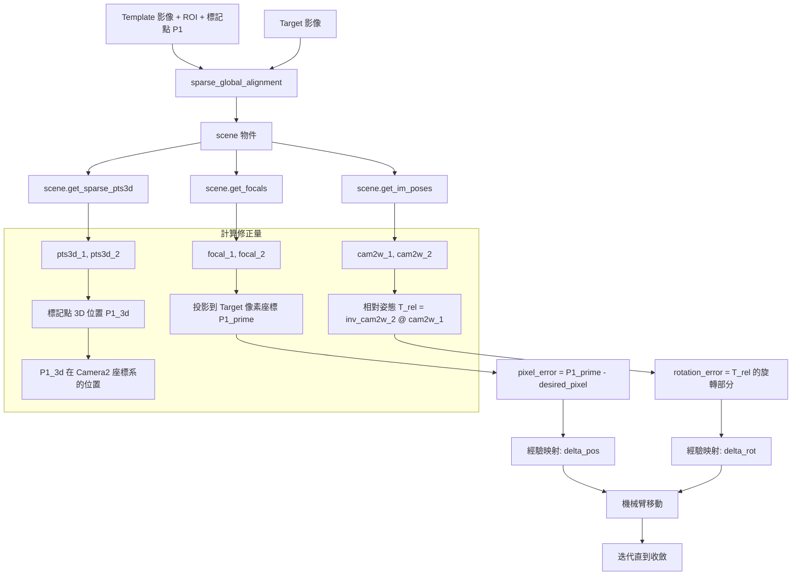
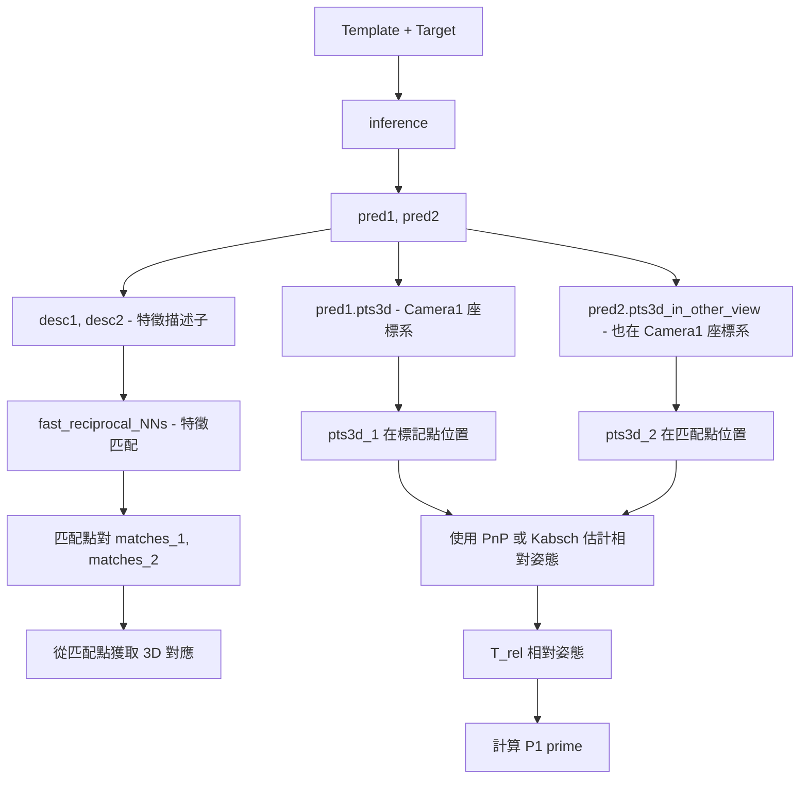
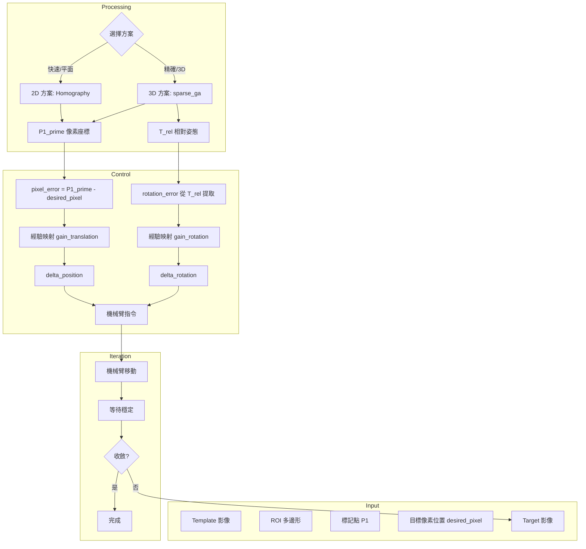

# 3D Visual Servo Workflow 架構設計

## 檔案規劃

### template_system 目錄結構

```
template_system/
├── __init__.py              # 匯出所有模組
├── manager.py               # 模板管理（現有）
├── matcher.py               # 2D 匹配器（現有）
├── matcher_3d.py            # 🆕 3D 匹配器（新增）
├── annotator.py             # 標註工具（現有）
└── visual_servo.py          # 🆕 視覺伺服控制器（新增）
```

### 新增檔案說明

| 檔案 | 用途 | 依賴 |
|------|------|------|
| `matcher_3d.py` | 使用 sparse_global_alignment 進行 3D 點轉換 | mast3r |
| `visual_servo.py` | 整合 2D/3D 匹配的視覺伺服控制迴圈 | matcher, matcher_3d |

---

## 使用場景

```
機械臂 + 手機相機
      │
      ▼
Template (參考圖)                    Target (當前拍攝)
┌─────────────────┐                 ┌─────────────────┐
│    ┌───┐        │                 │          ┌───┐ │
│    │ ★ │ ← P1   │      vs         │          │ ★ │ │ ← P1' 偏移了
│    └───┘        │                 │          └───┘ │
│   ROI 區域      │                 │                │
└─────────────────┘                 └─────────────────┘
      │                                     │
 desired_pixel                        current_pixel
      │                                     │
      └──────────────┬──────────────────────┘
                     ▼
            計算修正方向 + 步伐
                     │
                     ▼
              機械臂迭代調整
                     │
                     ▼
               收斂到目標位置
```

**限制條件：**
- ❌ 不能做手眼校正
- ✅ 相對方向是正確的
- ✅ 透過迭代收斂

---

## MASt3R 核心能力梳理

### 輸出說明

| API | 輸出 | 座標系 | 用途 |
|-----|------|--------|------|
| `inference()` | `pred1['pts3d']` | Camera 1 座標系 | View1 每個像素的 3D 位置 |
| `inference()` | `pred2['pts3d_in_other_view']` | Camera 1 座標系 | View2 的 3D 點，但表示在 Cam1 座標系 |
| `sparse_global_alignment()` | `cam2w[]` | 世界座標系 | 相機姿態 (Camera → World) |
| `sparse_global_alignment()` | `pts3d[]` | 世界座標系 | 優化後的 3D 點 |

### ⚠️ 目前程式碼的問題

在 `3d_polygon_target_transfer.py` 中：

```python
# Line 68-79: 用 sparse_ga 獲取 pose
scene = sparse_global_alignment(...)
poses = scene.get_im_poses()  # ← 世界座標系的姿態

# Line 96-98: 卻用 inference 獲取 pts3d
output = inference([tuple(images)], self.model, self.device)
points3D1 = output['pred1']['pts3d']  # ← Camera 1 座標系的 3D 點
```

**問題：座標系不一致！**
- `poses` 是從 sparse_ga 優化得到的世界座標系
- `pts3d` 是從 inference 得到的 Camera 1 座標系
- 兩者的尺度和座標原點可能不同

---

## 正確的 3D Workflow 設計

### 方案 A：統一使用 sparse_global_alignment（推薦）



### 方案 A 的程式碼修正

```python
class PolygonTargetTransfer3D:
    def compute_polygon_transfer(self, template_path, target_path, polygon_orig, target_point):
        """
        正確的 3D 轉換流程 - 統一使用 sparse_global_alignment
        """
        cache_dir = tempfile.mkdtemp()
        try:
            # ===== Step 1: 載入圖片 =====
            images = load_images([template_path, target_path], size=518)
            
            # ===== Step 2: 建立 pairs =====
            pairs_in = [[
                {"idx": 0, "instance": template_path, "img": images[0]["img"], "true_shape": ...},
                {"idx": 1, "instance": target_path, "img": images[1]["img"], "true_shape": ...}
            ]]
            
            # ===== Step 3: sparse_global_alignment =====
            scene = sparse_global_alignment(
                [template_path, target_path],
                pairs_in,
                cache_dir,
                self.model,
                device=self.device,
                lr1=0.0005, niter1=300,
                lr2=0.00005, niter2=0,  # 可以開啟 niter2 做 refinement
            )
            
            # ===== Step 4: 從 scene 獲取一致的數據 =====
            poses = scene.get_im_poses()           # [2, 4, 4] cam-to-world
            focals = scene.get_focals()            # [2]
            pts3d_list = scene.get_sparse_pts3d()  # [pts3d_1, pts3d_2] 在世界座標系
            
            # ===== Step 5: 找出標記點的 3D 位置 =====
            # 將標記點像素座標轉換為 pts3d 索引
            scale_x = res_shape[1] / orig_shape[1]
            scale_y = res_shape[0] / orig_shape[0]
            target_pixel_res = (target_point[0] * scale_x, target_point[1] * scale_y)
            
            # 從 pts3d_1 中取得標記點的 3D 位置
            # 注意：pts3d 是稀疏的，需要找最近的點或使用插值
            P1_3d_world = get_3d_point_at_pixel(pts3d_list[0], target_pixel_res)
            
            # ===== Step 6: 計算相對姿態 =====
            cam2w_1 = poses[0]  # Template 相機姿態
            cam2w_2 = poses[1]  # Target 相機姿態
            
            # 相對姿態: Camera2 到 Camera1
            w2cam_2 = np.linalg.inv(cam2w_2)
            T_rel = w2cam_2 @ cam2w_1  # cam1_to_cam2
            
            # ===== Step 7: 將 P1 投影到 Target 影像 =====
            P1_3d_cam2 = (w2cam_2 @ np.append(P1_3d_world, 1.0))[:3]
            
            focal2 = float(focals[1])
            cx2, cy2 = res_shape[1] / 2, res_shape[0] / 2
            
            P1_prime_x = focal2 * (P1_3d_cam2[0] / P1_3d_cam2[2]) + cx2
            P1_prime_y = focal2 * (P1_3d_cam2[1] / P1_3d_cam2[2]) + cy2
            
            # 轉回原始圖片座標
            P1_prime = (P1_prime_x / scale_x, P1_prime_y / scale_y)
            
            return {
                'P1_prime': P1_prime,              # 標記點在 Target 的像素位置
                'T_rel': T_rel,                    # 相對姿態矩陣
                'P1_3d_world': P1_3d_world,        # 標記點的 3D 世界座標
                'focals': (float(focals[0]), float(focals[1])),
            }
            
        finally:
            shutil.rmtree(cache_dir, ignore_errors=True)
```

---

### 方案 B：只使用 inference（快速版）

如果需要快速推理，可以只用 `inference()`，但需要額外步驟估計相對姿態：



**方案 B 的問題：**
1. `inference()` 輸出的 `pts3d` 沒有經過多視角一致性優化
2. 需要額外步驟估計相對姿態
3. 尺度可能不準確

---

## 2D vs 3D 方案比較

| 特性 | 2D 方案 (Homography/Affine) | 3D 方案 (sparse_ga) |
|------|------------------------------|---------------------|
| **速度** | 快（~100ms） | 慢（~2-5s）|
| **適用場景** | 近似平面物體 | 任意 3D 場景 |
| **透視變化** | 有限制 | 處理良好 |
| **輸出** | 2D 像素座標 | 2D 像素 + 3D 姿態 |
| **旋轉估計** | 無法直接獲得 | ✅ 可以獲得 |
| **深度變化** | 無法處理 | ✅ 可以估計 |

---

## 推薦的整合架構



---

## 控制迴圈偽代碼

```python
class VisualServoController:
    def __init__(self):
        self.transfer_3d = PolygonTargetTransfer3D()
        
        # 經驗增益（需要實驗調整）
        self.gain_translation = np.array([
            [0.0001, 0.0],      # pixel_error_x → delta_arm_x
            [0.0, 0.0001],      # pixel_error_y → delta_arm_y
        ])
        self.gain_rotation = 0.1  # rotation_error → delta_arm_rotation
        
    def servo_loop(self, template_path, roi, target_point, desired_pixel, 
                   max_iterations=20, pixel_threshold=5.0):
        """
        迭代視覺伺服控制迴圈
        """
        for iteration in range(max_iterations):
            # 1. 拍攝當前影像
            target_path = self.capture_image()
            
            # 2. 計算標記點位置和相對姿態
            result = self.transfer_3d.compute_polygon_transfer(
                template_path, target_path, roi, target_point
            )
            
            P1_prime = result['P1_prime']
            T_rel = result['T_rel']
            
            # 3. 計算像素誤差
            pixel_error = np.array(P1_prime) - np.array(desired_pixel)
            error_magnitude = np.linalg.norm(pixel_error)
            
            print(f"Iteration {iteration}: pixel_error = {pixel_error}, magnitude = {error_magnitude:.2f}")
            
            # 4. 檢查收斂
            if error_magnitude < pixel_threshold:
                print(f"Converged! Final error: {error_magnitude:.2f} pixels")
                return True
            
            # 5. 計算機械臂修正量
            # 平移部分
            delta_translation = self.gain_translation @ pixel_error
            
            # 旋轉部分（從 T_rel 提取）
            rotation_matrix = T_rel[:3, :3]
            # 使用 Rodrigues 或其他方法轉換為軸角表示
            rotation_angle = rotation_matrix_to_angle(rotation_matrix)
            delta_rotation = self.gain_rotation * rotation_angle
            
            # 6. 發送機械臂指令
            self.robot.move_relative(
                delta_x=delta_translation[0],
                delta_y=delta_translation[1],
                delta_rotation=delta_rotation
            )
            
            # 7. 等待機械臂穩定
            time.sleep(1.0)
        
        print(f"Max iterations reached. Final error: {error_magnitude:.2f} pixels")
        return False
```

---

## 總結

### 正確的 3D Workflow 核心原則

1. **座標系一致性**
   - 使用 `sparse_global_alignment` 時，所有數據（poses, pts3d）都在同一世界座標系
   - ❌ 不要混用 `inference()` 的 pts3d 和 `sparse_ga` 的 poses

2. **數據獲取順序**
   ```python
   scene = sparse_global_alignment(...)
   
   # 從同一個 scene 獲取所有需要的數據
   poses = scene.get_im_poses()
   pts3d = scene.get_sparse_pts3d()
   focals = scene.get_focals()
   ```

3. **相對姿態計算**
   ```python
   cam2w_1 = poses[0]  # Template camera pose
   cam2w_2 = poses[1]  # Target camera pose
   
   # 方法 1: Camera2 到 Camera1 的變換
   T_rel = inv(cam2w_2) @ cam2w_1
   
   # 方法 2: 直接計算差異（用於機械臂控制）
   position_diff = cam2w_2[:3, 3] - cam2w_1[:3, 3]
   rotation_diff = cam2w_2[:3, :3] @ cam2w_1[:3, :3].T
   ```

4. **迭代收斂**
   - 方向是對的，步伐用經驗增益調整
   - 多次迭代直到 pixel_error < threshold
