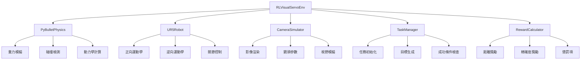

# RL 視覺伺服訓練環境架構設計

## 系統概述

基於 PyBullet 物理引擎設計的強化學習訓練環境，用於訓練視覺伺服任務。環境模擬 UR5 機械臂在桌面環境中執行精確對齊任務，整合視覺觀察、物理動力學和 RL 訓練介面。

### 核心特性
- **物理引擎**: PyBullet (輕量、高效能)
- **機械臂**: UR5 六自由度機械臂
- **任務**: 精確對齊 (alignment) - 將目標物體與參考位置對齊
- **觀察**: RGB 影像 + 機械臂狀態
- **動作**: 關節角度控制
- **獎勵**: 基於位置誤差和對齊精確度

---

## 1. 環境架構

### 1.1 主要組件



### 1.2 類別設計

```python
class RLVisualServoEnv(gym.Env):
    """RL 視覺伺服訓練環境"""

    def __init__(self, config):
        # 初始化 PyBullet 物理世界
        self.physics_client = p.connect(p.GUI)  # 或 p.DIRECT

        # 載入 UR5 機械臂
        self.robot = UR5Robot(self.physics_client, config['robot'])

        # 設定相機
        self.camera = CameraSimulator(self.physics_client, config['camera'])

        # 任務管理器
        self.task_manager = TaskManager(self.physics_client, config['task'])

        # 獎勵計算器
        self.reward_calculator = RewardCalculator(config['reward'])

        # 定義觀察和動作空間
        self.observation_space = self._define_observation_space()
        self.action_space = self._define_action_space()

    def reset(self):
        """重置環境"""
        # 重置物理世界
        p.resetSimulation(self.physics_client)

        # 重置機械臂到初始位置
        self.robot.reset()

        # 生成新任務
        self.task_manager.generate_task()

        # 返回初始觀察
        return self._get_observation()

    def step(self, action):
        """執行一步動作"""
        # 應用動作到機械臂
        self.robot.apply_action(action)

        # 步進物理模擬
        p.stepSimulation(self.physics_client)

        # 獲取新觀察
        observation = self._get_observation()

        # 計算獎勵
        reward = self.reward_calculator.compute_reward(
            self.robot.get_tcp_pose(),
            self.task_manager.get_target_pose()
        )

        # 檢查是否完成
        done = self.task_manager.check_completion(
            self.robot.get_tcp_pose(),
            self.task_manager.get_target_pose()
        )

        # 檢查是否超時或失敗
        done = done or self._check_timeout() or self._check_failure()

        return observation, reward, done, {}

    def _get_observation(self):
        """獲取當前觀察"""
        # 獲取相機影像
        rgb_image = self.camera.get_rgb_image()

        # 獲取機械臂狀態
        joint_angles = self.robot.get_joint_angles()
        tcp_pose = self.robot.get_tcp_pose()

        # 組合觀察
        return {
            'image': rgb_image,
            'joint_angles': joint_angles,
            'tcp_pose': tcp_pose
        }
```

---

## 2. 物理模擬設計

### 2.1 PyBullet 設定

```python
def setup_physics_world():
    """設定物理世界"""
    # 連接 PyBullet
    physics_client = p.connect(p.GUI)

    # 設定重力
    p.setGravity(0, 0, -9.81)

    # 設定時間步長
    p.setTimeStep(1/240)  # 240 Hz

    # 設定實時模擬 (可選)
    p.setRealTimeSimulation(0)  # 手動控制

    return physics_client
```

### 2.2 UR5 機械臂模擬

```python
class UR5Robot:
    """UR5 機械臂模擬"""

    def __init__(self, physics_client, config):
        self.client = physics_client
        self.config = config

        # 載入 UR5 URDF
        self.robot_id = p.loadURDF("ur5.urdf", [0, 0, 0])

        # 設定關節限制
        self.joint_limits = [
            (-np.pi, np.pi),     # 關節 1
            (-np.pi, np.pi),     # 關節 2
            (-np.pi/2, np.pi),   # 關節 3
            (-np.pi*2, np.pi*2), # 關節 4
            (-np.pi, np.pi),     # 關節 5
            (-np.pi, np.pi)      # 關節 6
        ]

        # 設定初始位置
        self.reset()

    def reset(self):
        """重置到初始位置"""
        initial_angles = [0, -np.pi/2, np.pi/2, -np.pi/2, -np.pi/2, 0]
        for i, angle in enumerate(initial_angles):
            p.resetJointState(self.robot_id, i, angle)

    def apply_action(self, action):
        """應用動作 (關節角度增量)"""
        current_angles = self.get_joint_angles()
        target_angles = current_angles + action

        # 限制在關節範圍內
        target_angles = np.clip(target_angles,
                               [lim[0] for lim in self.joint_limits],
                               [lim[1] for lim in self.joint_limits])

        # 設定關節目標
        for i, angle in enumerate(target_angles):
            p.setJointMotorControl2(
                self.robot_id, i,
                controlMode=p.POSITION_CONTROL,
                targetPosition=angle,
                force=300  # 力矩限制
            )

    def get_joint_angles(self):
        """獲取當前關節角度"""
        joint_states = p.getJointStates(self.robot_id, range(6))
        return np.array([state[0] for state in joint_states])

    def get_tcp_pose(self):
        """獲取 TCP 姿態"""
        # 計算正向運動學
        link_state = p.getLinkState(self.robot_id, 6)  # TCP 鏈接
        position = link_state[0]
        orientation = link_state[1]
        return position, orientation
```

---

## 3. 鏡頭模擬系統

### 3.1 相機參數

```python
class CameraSimulator:
    """相機模擬器"""

    def __init__(self, physics_client, config):
        self.client = physics_client
        self.config = config

        # 相機內參
        self.image_width = config.get('width', 640)
        self.image_height = config.get('height', 480)
        self.fov = config.get('fov', 60)  # 視野角度
        self.near = config.get('near', 0.1)
        self.far = config.get('far', 10.0)

        # 相機姿態 (相對於世界座標系)
        self.camera_position = config.get('position', [0.5, 0, 0.5])
        self.camera_orientation = config.get('orientation', [0, 0, 0, 1])

        # 投影矩陣
        self.projection_matrix = self._compute_projection_matrix()

    def get_rgb_image(self):
        """獲取 RGB 影像"""
        # 設定相機姿態
        view_matrix = self._compute_view_matrix()

        # 渲染影像
        images = p.getCameraImage(
            width=self.image_width,
            height=self.image_height,
            viewMatrix=view_matrix,
            projectionMatrix=self.projection_matrix,
            renderer=p.ER_BULLET_HARDWARE_OPENGL
        )

        # 提取 RGB 通道
        rgb_image = np.array(images[2])  # RGB
        rgb_image = rgb_image.reshape((self.image_height, self.image_width, 4))
        rgb_image = rgb_image[:, :, :3]  # 移除 alpha 通道

        return rgb_image

    def _compute_view_matrix(self):
        """計算視圖矩陣"""
        # 基於相機位置和方向
        rot_matrix = p.getMatrixFromQuaternion(self.camera_orientation)
        rot_matrix = np.array(rot_matrix).reshape(3, 3)

        # 相機座標系轉換
        camera_vector = rot_matrix @ np.array([1, 0, 0])  # 前向
        up_vector = rot_matrix @ np.array([0, 0, 1])      # 上向

        view_matrix = p.computeViewMatrix(
            cameraEyePosition=self.camera_position,
            cameraTargetPosition=self.camera_position + camera_vector,
            cameraUpVector=up_vector
        )

        return view_matrix

    def _compute_projection_matrix(self):
        """計算投影矩陣"""
        aspect = self.image_width / self.image_height
        projection_matrix = p.computeProjectionMatrixFOV(
            fov=self.fov,
            aspect=aspect,
            nearVal=self.near,
            farVal=self.far
        )
        return projection_matrix
```

---

## 4. 任務設計

### 4.1 精確對齊任務

```python
class TaskManager:
    """任務管理器"""

    def __init__(self, physics_client, config):
        self.client = physics_client
        self.config = config

        # 目標物體
        self.target_object = None
        self.target_pose = None

        # 參考位置
        self.reference_pose = config.get('reference_pose', [0.5, 0, 0.1])

    def generate_task(self):
        """生成新任務"""
        # 載入或創建目標物體
        if self.target_object is None:
            self.target_object = p.loadURDF("cube.urdf", [0.5, 0, 0.1])

        # 隨機設定目標姿態 (小範圍擾動)
        base_pose = self.reference_pose
        noise_range = self.config.get('noise_range', 0.05)

        # 位置擾動
        position_noise = np.random.uniform(-noise_range, noise_range, 3)
        target_position = np.array(base_pose[:3]) + position_noise

        # 旋轉擾動 (小角度)
        rotation_noise = np.random.uniform(-np.pi/18, np.pi/18, 3)  # ±10度
        target_orientation = p.getQuaternionFromEuler(rotation_noise)

        self.target_pose = (target_position, target_orientation)

        # 設定物體姿態
        p.resetBasePositionAndOrientation(
            self.target_object,
            target_position,
            target_orientation
        )

    def get_target_pose(self):
        """獲取目標姿態"""
        return self.target_pose

    def check_completion(self, tcp_pose, target_pose):
        """檢查任務完成"""
        tcp_position, tcp_orientation = tcp_pose
        target_position, target_orientation = target_pose

        # 位置誤差
        position_error = np.linalg.norm(tcp_position - target_position)

        # 方向誤差 (簡化為 Z 軸對齊)
        tcp_euler = p.getEulerFromQuaternion(tcp_orientation)
        target_euler = p.getEulerFromQuaternion(target_orientation)
        orientation_error = abs(tcp_euler[2] - target_euler[2])  # Z 旋轉

        # 完成條件
        position_threshold = self.config.get('position_threshold', 0.01)  # 1cm
        orientation_threshold = self.config.get('orientation_threshold', np.pi/36)  # 5度

        return (position_error < position_threshold and
                orientation_error < orientation_threshold)
```

---

## 5. RL 介面設計

### 5.1 觀察空間

```python
def _define_observation_space(self):
    """定義觀察空間"""
    # 影像觀察
    image_space = spaces.Box(
        low=0, high=255,
        shape=(self.camera.image_height, self.camera.image_width, 3),
        dtype=np.uint8
    )

    # 機械臂狀態
    joint_space = spaces.Box(
        low=np.array([lim[0] for lim in self.robot.joint_limits]),
        high=np.array([lim[1] for lim in self.robot.joint_limits]),
        dtype=np.float32
    )

    # TCP 姿態 (可選)
    tcp_space = spaces.Box(
        low=np.array([-1, -1, -1, -1, -1, -1, -1]),  # 位置 + 四元數
        high=np.array([1, 1, 1, 1, 1, 1, 1]),
        dtype=np.float32
    )

    # 組合觀察空間
    return spaces.Dict({
        'image': image_space,
        'joint_angles': joint_space,
        'tcp_pose': tcp_space
    })
```

### 5.2 動作空間

```python
def _define_action_space(self):
    """定義動作空間"""
    # 關節角度增量控制
    # 每個關節的角速度或位置增量
    action_low = np.array([-0.1, -0.1, -0.1, -0.1, -0.1, -0.1])  # 弧度/步
    action_high = np.array([0.1, 0.1, 0.1, 0.1, 0.1, 0.1])

    return spaces.Box(
        low=action_low,
        high=action_high,
        dtype=np.float32
    )
```

### 5.3 獎勵函數

```python
class RewardCalculator:
    """獎勵計算器"""

    def __init__(self, config):
        self.config = config
        self.previous_error = None

    def compute_reward(self, tcp_pose, target_pose):
        """計算獎勵"""
        tcp_position, tcp_orientation = tcp_pose
        target_position, target_orientation = target_pose

        # 位置誤差
        position_error = np.linalg.norm(tcp_position - target_position)

        # 方向誤差
        tcp_euler = p.getEulerFromQuaternion(tcp_orientation)
        target_euler = p.getEulerFromQuaternion(target_orientation)
        orientation_error = abs(tcp_euler[2] - target_euler[2])

        # 距離獎勵 (負距離)
        distance_reward = -position_error * self.config.get('distance_weight', 10.0)

        # 精確度獎勵 (當接近目標時給予額外獎勵)
        precision_reward = 0
        if position_error < 0.02:  # 2cm 內
            precision_reward = self.config.get('precision_bonus', 1.0)

        # 進步獎勵 (與前一步比較)
        progress_reward = 0
        if self.previous_error is not None:
            error_improvement = self.previous_error - position_error
            if error_improvement > 0:
                progress_reward = error_improvement * self.config.get('progress_weight', 5.0)

        self.previous_error = position_error

        # 總獎勵
        total_reward = distance_reward + precision_reward + progress_reward

        # 任務完成獎勵
        if position_error < 0.01 and orientation_error < np.pi/36:  # 1cm, 5度
            total_reward += self.config.get('completion_bonus', 100.0)

        return total_reward
```

---

## 6. 訓練和測試

### 6.1 環境配置

```yaml
# config.yaml
environment:
  physics:
    time_step: 0.004  # 250 Hz
    gravity: [0, 0, -9.81]
    real_time: false

  robot:
    urdf_path: "ur5.urdf"
    initial_pose: [0, -1.57, 1.57, -1.57, -1.57, 0]
    joint_limits:
      - [-3.14, 3.14]
      - [-3.14, 3.14]
      - [-1.57, 3.14]
      - [-6.28, 6.28]
      - [-3.14, 3.14]
      - [-3.14, 3.14]

  camera:
    width: 640
    height: 480
    fov: 60
    position: [0.5, 0, 0.5]
    orientation: [0, 0, 0, 1]

  task:
    reference_pose: [0.5, 0, 0.1]
    noise_range: 0.05
    position_threshold: 0.01
    orientation_threshold: 0.087  # 5度

  reward:
    distance_weight: 10.0
    precision_bonus: 1.0
    progress_weight: 5.0
    completion_bonus: 100.0

  training:
    max_episode_steps: 200
    success_threshold: 0.01
```

### 6.2 訓練腳本

```python
# train.py
import gym
from stable_baselines3 import PPO
from rl_visual_servo_env import RLVisualServoEnv

def main():
    # 載入配置
    with open('config.yaml', 'r') as f:
        config = yaml.safe_load(f)

    # 創建環境
    env = RLVisualServoEnv(config)

    # 創建代理
    model = PPO(
        "MultiInputPolicy",
        env,
        verbose=1,
        tensorboard_log="./tensorboard/"
    )

    # 訓練
    model.learn(total_timesteps=100000)

    # 保存模型
    model.save("visual_servo_ppo")

if __name__ == "__main__":
    main()
```

---

## 7. 實現步驟和優先順序

### Phase 1: 基礎架構 (1-2週)
1. **設定 PyBullet 環境** - 安裝依賴，載入 UR5 URDF
2. **實現基本 RL 介面** - Gym 環境類別，觀察/動作空間
3. **UR5 機械臂模擬** - 正向/逆向運動學，關節控制

### Phase 2: 視覺和任務 (2-3週)
4. **鏡頭模擬系統** - 影像渲染，相機參數設定
5. **任務管理器** - 目標生成，完成條件檢查
6. **獎勵函數設計** - 距離獎勵，精確度獎勵，進步獎勵

### Phase 3: 整合和測試 (1-2週)
7. **環境整合** - 連接所有組件，確保穩定運行
8. **安全和限制** - 碰撞檢測，關節限制，超時處理
9. **訓練測試** - 基本 RL 訓練，效能評估

### Phase 4: 優化和擴展 (1週)
10. **效能優化** - 渲染速度，模擬效率
11. **擴展功能** - 多種任務類型，難度調整
12. **文檔和範例** - 使用指南，訓練範例

---

## 8. 技術考量

### 8.1 效能需求
- **模擬頻率**: 240-500 Hz (物理步進)
- **影像渲染**: 30-60 FPS (訓練時可降低)
- **訓練樣本**: 10^5 - 10^6 步 (視任務複雜度)
- **收斂時間**: 精確對齊任務預計需要 50-200 步

### 8.2 穩定性考量
- **數值穩定**: 關節角度限制，位置邊界檢查
- **碰撞避免**: 基本碰撞檢測，緊急停止
- **重置可靠性**: 確保每次重置都回到一致狀態

### 8.3 擴展性
- **多種任務**: 拾取、組裝、軌跡追蹤
- **不同機械臂**: 支持其他型號 (Panda, Kuka 等)
- **多相機**: 立體視覺，環繞視角

此設計提供完整的 RL 視覺伺服訓練環境，整合物理模擬、視覺觀察和強化學習介面，支援精確對齊任務的訓練和測試。