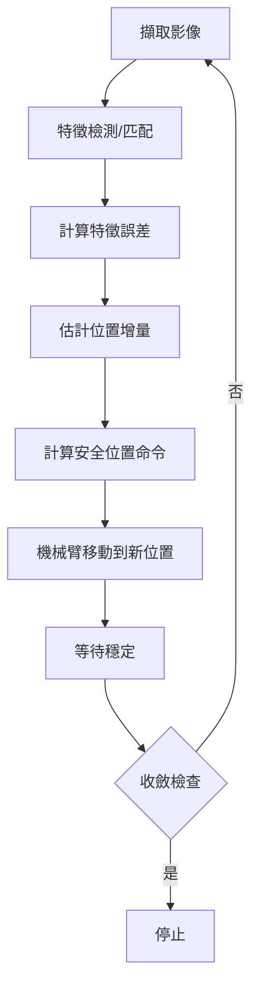
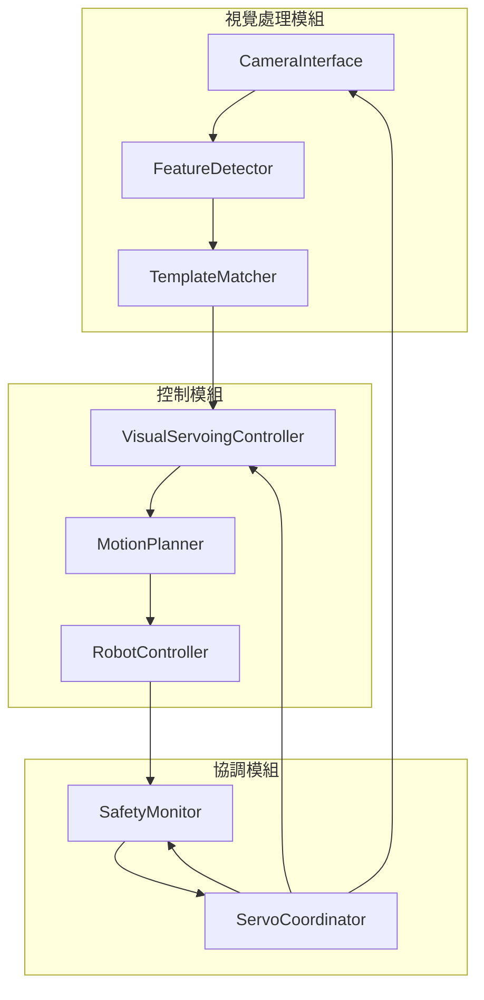

# 視覺伺服控制系統架構設計

## 系統概述

基於現有的模板匹配系統，擴展加入視覺伺服控制功能，使機械臂能夠根據相機影像自動調整姿態，實現精確定位。

### 當前系統狀態
- ✅ MASt3R 特徵匹配引擎
- ✅ 多邊形 ROI 過濾
- ✅ 幾何變換計算 (homography/affine)
- ✅ 關鍵點轉換功能
- ✅ 模板管理系統

### 擴展需求
- 🔄 像素座標 → 世界座標轉換
- 🔄 視覺伺服控制迴圈
- 🔄 機械臂運動控制介面
- 🔄 即時影像處理管線

---

## 1. 座標系統設計

### 1.1 座標系定義

```
機械臂TCP座標系 (Robot TCP Frame):
  - 原點: 工具中心點 (TCP)
  - X軸: 右邊方向 (正向)
  - Y軸: 向下方向 (正向)
  - Z軸: 向前方向 (正向，沿工具軸)

世界座標系 (World/Base Frame):
  - 原點: 機械臂基座中心
  - 通常與TCP座標系對齊，但可通過基座變換調整

相機座標系 (Camera Frame):
  - 原點: 相機光心
  - X軸: 右手方向 (與TCP X軸對齊)
  - Y軸: 向下方向 (與TCP Y軸對齊)
  - Z軸: 遠離鏡頭 (負向，朝向場景)

像素座標系 (Image Frame):
  - 原點: 影像左上角 (0,0)
  - U軸: 向右增加
  - V軸: 向下增加
```

### 1.2 控制策略 (無手眼校正)

**限制**: 不進行手眼校正，相機與TCP之間沒有精確的座標轉換關係。

**替代方案**: 使用經驗性映射
- 在影像平面上計算特徵點誤差
- 使用經驗增益將像素誤差轉換為TCP位置增量
- 通過多次迭代學習和調整映射關係

#### 1.2.1 經驗性像素 → TCP映射

```python
def pixel_error_to_tcp_increment(pixel_error, empirical_gain):
    """
    使用經驗增益將像素誤差轉換為TCP位置增量

    Args:
        pixel_error: 像素誤差 [delta_u, delta_v]
        empirical_gain: 經驗增益矩陣 [[gain_x_u, gain_x_v],
                                       [gain_y_u, gain_y_v],
                                       [gain_z_u, gain_z_v]]
                      通過實驗校正獲得

    Returns:
        tcp_increment: TCP位置增量 [dx, dy, dz]
    """
    return empirical_gain @ pixel_error
```

### 1.3 相機校正參數

```python
class CameraCalibration:
    def __init__(self):
        # 相機內參 (需校正獲得)
        self.K = np.array([
            [fx,  0, cx],
            [ 0, fy, cy],
            [ 0,  0,  1]
        ])

        # 經驗增益矩陣: 像素誤差 → TCP位置增量
        # 通過實驗校正獲得，形狀 (3, 2)
        # [[dx/du, dx/dv],
        #  [dy/du, dy/dv],
        #  [dz/du, dz/dv]]
        self.empirical_gain = np.array([
            [0.001, 0.000],  # X方向增益 (m/pixel)
            [0.000, 0.001],  # Y方向增益 (m/pixel)
            [0.000, 0.000]   # Z方向增益 (通常為0)
        ])

        # 畸變係數 (若有)
        self.dist_coeffs = np.zeros(5)
```

---

## 2. 視覺伺服控制架構

### 2.1 控制策略

採用 **位置控制的迭代視覺伺服**：
- 基於位置控制而非速度控制
- 每次計算小的位置增量，機械臂移動後重新觀察
- 安全限制：只允許 ±5cm 的修正範圍
- 通過多次迭代實現精確定位

### 2.2 控制迴圈



### 2.3 特徵誤差計算

```python
class VisualServoingController:
    def __init__(self, desired_features, camera_params):
        self.s_star = desired_features  # 期望特徵點位置 [u*, v*]
        self.camera = camera_params
        self.lamda = 0.5  # 控制增益

    def compute_error(self, current_features):
        """
        計算特徵誤差向量

        Args:
            current_features: 當前特徵點位置 [[u1,v1], [u2,v2], ...]

        Returns:
            error: 誤差向量 (2N x 1)
        """
        s = np.array(current_features).flatten()
        return s - self.s_star
```

### 2.4 簡化控制策略 (無手眼校正)

**策略**: 使用經驗映射而非複雜的雅可比矩陣
- 計算特徵點的平均像素誤差
- 使用經驗增益矩陣直接轉換為TCP位置增量
- 不需要估計深度或計算複雜的雅可比矩陣

### 2.5 位置增量計算 (經驗映射)

```python
def compute_position_increment(error, empirical_gain, max_increment=0.01):
    """
    使用經驗增益計算位置增量

    Args:
        error: 特徵誤差向量 [delta_u, delta_v] (像素)
        empirical_gain: 經驗增益矩陣 (3x2)
        max_increment: 最大允許增量 (m)

    Returns:
        delta_pos: 位置增量 [dx, dy, dz] (TCP座標系)
    """
    # 使用經驗增益矩陣直接映射
    delta_pos = empirical_gain @ error

    # 限制最大增量 (安全考量)
    delta_pos = np.clip(delta_pos, -max_increment, max_increment)

    # 進一步限制在 ±5cm 範圍內
    delta_pos = np.clip(delta_pos, -0.05, 0.05)

    return delta_pos
```

---

## 3. 運動控制介面

### 3.1 機械臂控制器抽象

```python
class RobotController:
    def __init__(self, robot_type='ur5e'):
        self.robot_type = robot_type
        self.connection = None

    def connect(self, ip_address, port=30002):
        """建立與機械臂的連接"""
        pass

    def get_current_pose(self):
        """獲取當前姿態"""
        return pose  # [x, y, z, rx, ry, rz]

    def move_to_position(self, position):
        """移動到指定位置 (絕對位置)"""
        pass

    def move_relative(self, delta_position):
        """相對移動指定增量"""
        pass

    def stop(self):
        """緊急停止"""
        pass
```

### 3.2 位置控制介面

**直接使用TCP位置控制**:
- 機械臂接受絕對位置命令或相對位移
- 無需速度映射，因為我們使用位置增量控制
- 每次發送小的位置增量，等待執行完成

### 3.3 安全限制

```python
class SafetyController:
    def __init__(self):
        # 位置增量限制 (每次迭代的最大移動距離)
        self.max_position_increment = 0.01  # 1cm 最大增量
        self.safety_position_limits = {
            'x': [-0.05, 0.05],   # ±5cm X方向
            'y': [-0.05, 0.05],   # ±5cm Y方向
            'z': [-0.05, 0.05]    # ±5cm Z方向
        }

    def limit_position_increment(self, delta_pos):
        """限制位置增量在安全範圍內"""
        limited_pos = np.clip(delta_pos,
                             [self.safety_position_limits['x'][0],
                              self.safety_position_limits['y'][0],
                              self.safety_position_limits['z'][0]],
                             [self.safety_position_limits['x'][1],
                              self.safety_position_limits['y'][1],
                              self.safety_position_limits['z'][1]])
        return limited_pos

    def check_increment_safety(self, delta_pos):
        """檢查位置增量是否安全"""
        max_delta = np.max(np.abs(delta_pos))
        return max_delta <= self.max_position_increment
```

---

## 4. 系統整合架構

### 4.1 主要模組



### 4.2 類別設計

```python
class VisualServoSystem:
    """完整的視覺伺服系統"""

    def __init__(self, config):
        self.camera = CameraInterface(config['camera'])
        self.template_matcher = TemplateMatcher(config['template'])
        self.controller = VisualServoingController(config['control'])
        self.robot = RobotController(config['robot'])
        self.safety = SafetyController(config['safety'])

    def initialize(self, template_rule, template_key):
        """初始化系統"""
        self.template_matcher.load_templates(template_rule, template_key)
        self.robot.connect()
        self.camera.start_stream()

    def servo_to_target(self, target_features, max_iterations=20, convergence_threshold=2.0):
        """執行位置控制的迭代視覺伺服"""
        iteration = 0

        while iteration < max_iterations:
            # 1. 擷取影像
            image = self.camera.get_frame()

            # 2. 特徵匹配
            current_features = self.template_matcher.match_and_transform(image)

            # 3. 計算誤差
            error = self.controller.compute_error(current_features, target_features)

            # 4. 檢查收斂 (像素誤差)
            if np.linalg.norm(error) < convergence_threshold:
                print(f"收斂達成，迭代次數: {iteration}")
                break

            # 5. 計算位置增量
            delta_pos = self.controller.compute_position_increment(error)

            # 6. 安全檢查和限制
            if not self.safety.check_increment_safety(delta_pos):
                print(f"位置增量過大，已限制: {delta_pos}")
                delta_pos = self.safety.limit_position_increment(delta_pos)

            # 7. 檢查是否有意義的移動
            if np.linalg.norm(delta_pos) < 1e-6:  # 太小的移動
                print("位置增量太小，停止迭代")
                break

            # 8. 執行相對移動
            print(f"迭代 {iteration}: 誤差={np.linalg.norm(error):.2f}px, 增量={delta_pos}")
            self.robot.move_relative(delta_pos)

            # 9. 等待機械臂穩定
            time.sleep(1.0)  # 等待移動完成

            iteration += 1

        if iteration >= max_iterations:
            print(f"達到最大迭代次數 ({max_iterations})")
```

---

## 5. 實現步驟和優先順序

### Phase 1: 基礎架構 (1-2週)
1. **設計座標系統類別** - `CameraCalibration`, `CoordinateTransformer`
2. **實現相機介面** - 影像擷取和基本處理
3. **擴展模板匹配器** - 支援即時匹配

### Phase 2: 控制核心 (2-3週)
4. **實現視覺伺服控制器** - IBVS 演算法
5. **設計運動控制介面** - 抽象機器人控制器
6. **整合安全監控** - 速度和位置限制

### Phase 3: 系統整合 (1-2週)
7. **建立協調器** - 整合所有模組
8. **實現控制迴圈** - 即時視覺伺服
9. **測試和校正** - 實際機械臂測試

### Phase 4: 優化和擴展 (1週)
10. **效能優化** - 處理速度和準確度
11. **錯誤處理** - 異常情況處理
12. **文檔和測試** - 完整測試套件

---

## 6. 技術考量

### 6.1 效能需求
- **迭代頻率**: 0.5-1 Hz (每次移動後等待穩定)
- **單次處理延遲**: < 500ms (影像處理 + 匹配)
- **準確度**: < 2像素 (特徵點定位，考慮迭代收斂)
- **收斂時間**: < 30秒 (典型20次迭代以內)

### 6.2 校正需求
- **相機內參**: 需預先校正 (fx, fy, cx, cy)
- **經驗校正**: 通過實驗確定像素誤差到TCP位置增量的映射關係
- **模板校正**: 確保模板與實際目標一致

### 6.3 安全考量
- **速度限制**: 避免過快運動造成損壞
- **工作空間**: 防止超出機械臂可達範圍
- **緊急停止**: 支援即時停止功能

---

## 7. 結論

此設計基於現有模板匹配系統，通過加入視覺伺服控制實現自動精確定位。採用模組化設計，易於維護和擴展。重點關注安全性和實時性，確保在實際應用中的可靠性。